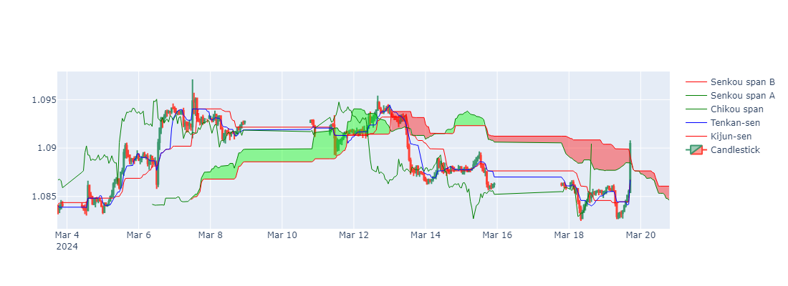

# Ichimoku Cloud Indicator with Python



This Python script visualizes the Ichimoku Cloud trading strategy using historical market data. The Ichimoku Cloud is a comprehensive technical analysis method providing insights into market momentum, trend direction, and support and resistance levels.

## Prerequisites

Ensure you have the requirements file installed.

You can install the file using pip:

```sh
pip install -r requirements.txt
```

## Environment Variables

Create a `.env` file in your project directory and add your `CLIENT_ID` and `CLIENT_SECRET`:

```env
CLIENT_ID=your_client_id
CLIENT_SECRET=your_client_secret
```

These variables enable secure access to market data from the [HSTRADER](https://staging.hstrader.com/login) platform.

**Reminder:**
Your unique `CLIENT_ID` and `CLIENT_SECRET` can be obtained from your personal account on the platform. Ensure you keep them confidential to protect your data.

## Usage

1. **Import the necessary modules and load your environment variables.**
2. **Initialize the `HsTrader` client with your credentials.**
3. **Retrieve the symbol for the desired currency pair (e.g., ‘EURUSD’).**
4. **Fetch the market history data at the specified resolution.**
5. **Process the data to calculate the Ichimoku Cloud components.**
6. **Visualize the data using Plotly to create an interactive candlestick chart with Ichimoku Cloud overlays.**

## Ichimoku Cloud

The Ichimoku Cloud, also known as Ichimoku Kinko Hyo, is a versatile indicator defining support and resistance, identifying trend direction, gauging momentum, and providing trading signals. Developed by Goichi Hosoda, a Japanese journalist, it was published in his 1969 book.

### Components of Ichimoku Cloud

1. **Tenkan-sen (Conversion Line):**
   - Calculation: (9-period high + 9-period low) / 2
   - Purpose: Measures short-term momentum and identifies potential trend reversals.

2. **Kijun-sen (Base Line):**
   - Calculation: (26-period high + 26-period low) / 2
   - Purpose: Measures medium-term momentum and acts as a support/resistance level.

3. **Chikou Span (Lagging Span):**
   - Calculation: Current closing price plotted 26 periods behind.
   - Purpose: Confirms trends and signals potential reversals when crossing past prices.

4. **Senkou Span A (Leading Span A):**
   - Calculation: (Tenkan-sen + Kijun-sen) / 2 plotted 26 periods ahead.
   - Purpose: Forms one of the cloud boundaries and identifies future support/resistance.

5. **Senkou Span B (Leading Span B):**
   - Calculation: (52-period high + 52-period low) / 2 plotted 26 periods ahead.
   - Purpose: Forms the other cloud boundary and identifies future support/resistance.

### The Cloud (Kumo)

The area between Senkou Span A and Senkou Span B is called the Kumo, or cloud. The cloud is a key element of the Ichimoku system and is used to identify trends and potential reversals. A price above the cloud indicates an uptrend, while a price below the cloud indicates a downtrend. When the price is within the cloud, it suggests a period of consolidation or uncertainty.

### Why Use Ichimoku Cloud?

1. **Comprehensive Indicator:**
   - Combines multiple elements to provide a comprehensive view of the market, including trend direction, momentum, and support/resistance levels.

2. **Clear Visualization:**
   - The cloud structure offers a clear visual representation of potential support and resistance zones, making it easier for traders to identify key levels.

3. **Trend Identification:**
   - By observing the position of the price relative to the cloud and the interaction of the Tenkan-sen and Kijun-sen, traders can identify the prevailing trend and make informed trading decisions.

4. **Trading Signals:**
   - The Ichimoku Cloud generates trading signals through the crossover of its lines (e.g., Tenkan-sen crossing Kijun-sen) and the price breaking through the cloud. These signals help traders enter or exit positions effectively.

## Visualization

The final visualization is an interactive chart that displays:

- Candlestick representation of price movements.
- Ichimoku Cloud components with appropriate color coding.
- Customizable layout options for the chart dimensions and visibility of the range slider.

## Running the Script

To run the script, simply execute it in your Python environment.

## Conclusion

The Ichimoku Cloud is a powerful tool for technical analysis, offering traders a multi-dimensional view of the market. Its ability to provide insights into trend direction, momentum, and key support/resistance levels makes it an invaluable indicator for both novice and experienced traders.
